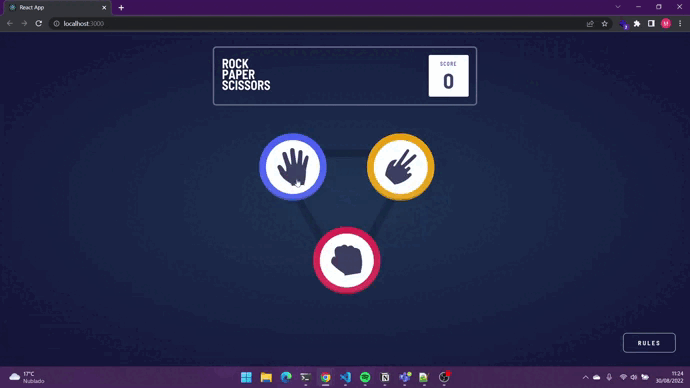

# Frontend Mentor Challenge: Rock, Paper, Scissors game

React app of the game rock-paper-scissors.

## Demonstration

[link for github page here]

## Linguages and tools

- JavaScript (React)
- HTML
- CSS

## What I learn/practice white this challenge

- CSS Grid
- React: State lift

## Screenshots

